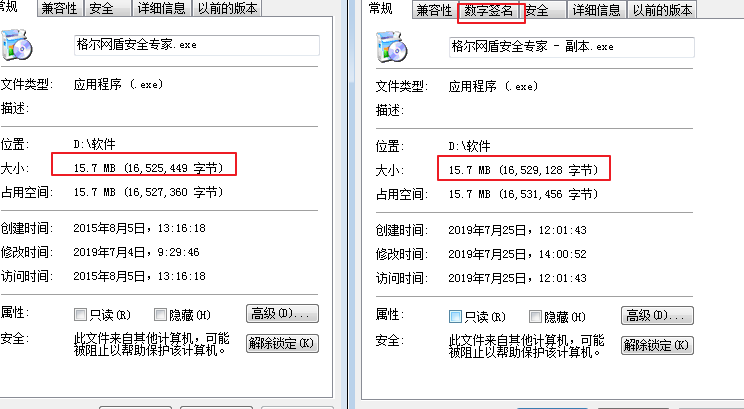

## windows下应用签名

### 实践：给本地一个exe文件签名  
#### 1. 工具：
- Makecert.exe
- Cert2spc.exe
- pvk2pfx.exe
- signtool.exe

安装方式：上述软件均随visual studio附带。如需使用，先安装vs。  
执行方式：在开始菜单的vs目录下，点击visual studio命令提示符，通过命令行方式执行。  

#### 2. 签名测试

- **创建 X.509 证书**  
Makecert -sv kyle.pvk -r -n "CN=kyle's software company" kyle.cer  
-sv kyle.pvk创建一个密钥文件，来保存私钥，创建时需要输入一个密码。  
执行后，当前目录会生成两个文件，kyle.pvk，kyle.cert。

- **创建发行者证书**  
Cert2spc kyle.cer kyle.spc  

- **导出pfx证书文件**  
pvk2pfx -pvk kyle.pvk -pi mypassword -spc kyle.spc -pfx kyle.pfx -f  
-pi 后面接你的私钥密码

- **对软件签名**  
signtool sign /f kyle.pfx /p mypassword abc.exe  

- **加盖时间戳**  
signtool timestamp /t http://timestamp.verisign.com/scripts/timstamp.dll abc.exe  
/t 后面接时间戳签名服务的URL，示例是一个国外提供免费时间戳签名的URL。

- **最终效果**

签名后查看应用的属性时属性栏会多一个数字签名的选项卡，这里可以看到我们之前加的签名及时间戳信息。可以注意到签名之后应用的大小会略微大于签名前。多出来的这部分应该是我们签名信息。
